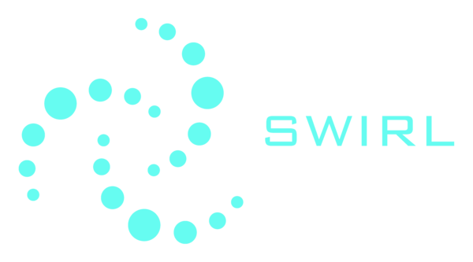

## Overview

### Contracts and their addresses on BSC

 * SwirlCash.sol - SWIRL token contract. [0x52d86850bc8207b520340b7e39cdaf22561b9e56](https://bscscan.com/address/0x52d86850bc8207b520340b7e39cdaf22561b9e56)
 * SwirlLiquidityMining.sol - SWIRL liquidity mining contract. [0x9FC04657C1178F857d36D8a6B028C732D78F60E0](https://bscscan.com/address/0x9FC04657C1178F857d36D8a6B028C732D78F60E0)
 * SwirlStaking.sol - SWIRL staking contract. [0x258a85ebB943347A48275735ce59dD62172b63f1](https://bscscan.com/address/0x258a85ebB943347A48275735ce59dD62172b63f1)

### Installation

Before running any command, make sure to install all dependencies:

```console
$ npm install
```

### Test

Run all tests via Truffle:

```console
$ truffle test
```

### Compile

Compile all contracts via Truffle:

```console
$ truffle compile
```

### Deploy

Deploy on local Truffle Develop blockchain:

```console
$ truffle develop
$ migrate
```

### Learn More

**For full usage information refer to [Truffle documentation](https://www.trufflesuite.com/docs/truffle/overview).**
